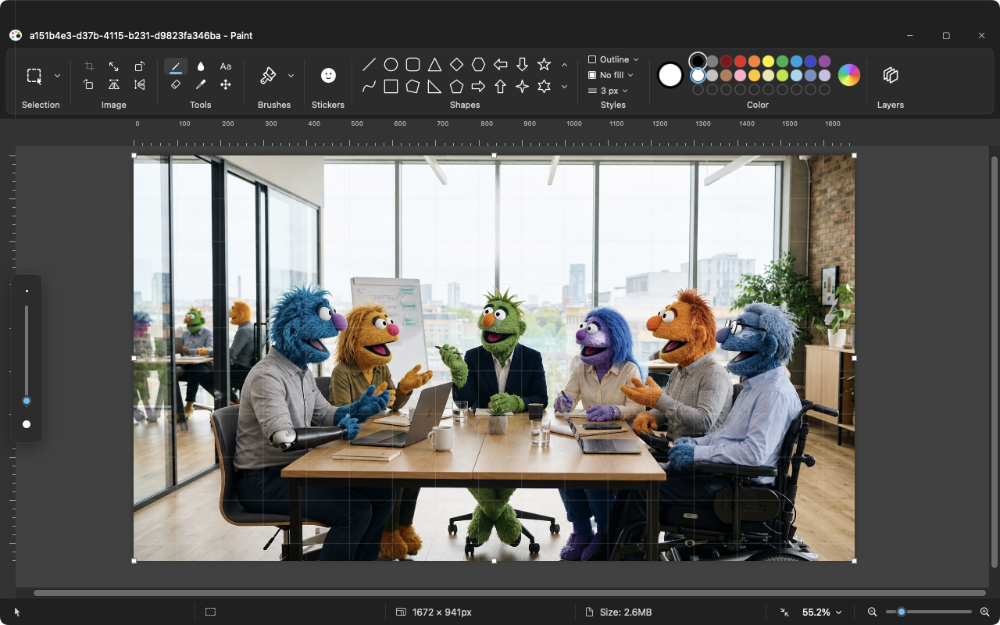

# MacPaint

A native macOS reimplementation of MS Paint.

Built because classic MS Paint is really the only native OS paint app that's usable without being overbuilt.

> **Note:** 100% vibe-coded using Claude Fable.

## In this fork

- native drag onto editor to open
- 'open with' support for common image formats
- new fill types, fixes to brushes
- draggable layers
- more natural feeling zoom control
- rulers & gridlines obey zoom
- text entry box size fix
- easier fill/outline selection using left/right click




## Features

- **Native macOS Feel:** Lightweight, fast startup, and native system integration.
- **Classic MS Paint Tools:** Essential drawing, selection, and color-picking capabilities.
- **Simple Development Setup:** Swift-native toolchain with zero heavy dependencies.

## Requirements

- macOS 14.0 or later
- Swift toolchain (Xcode Command Line Tools)

## Building & Running

Requires macOS 14+ and the Swift toolchain (Xcode Command Line Tools are enough).

```sh
./scripts/build-app.sh     # builds release + assembles Paint.app
open Paint.app
```

For development:

```sh
swift run Paint
```

## Legal & Disclaimer
MS Paint and Microsoft Paint are trademarks or registered trademarks of Microsoft Corporation in the United States and/or other countries. This project is an independent open-source recreation and is not affiliated with, endorsed by, or sponsored by Microsoft Corporation.
